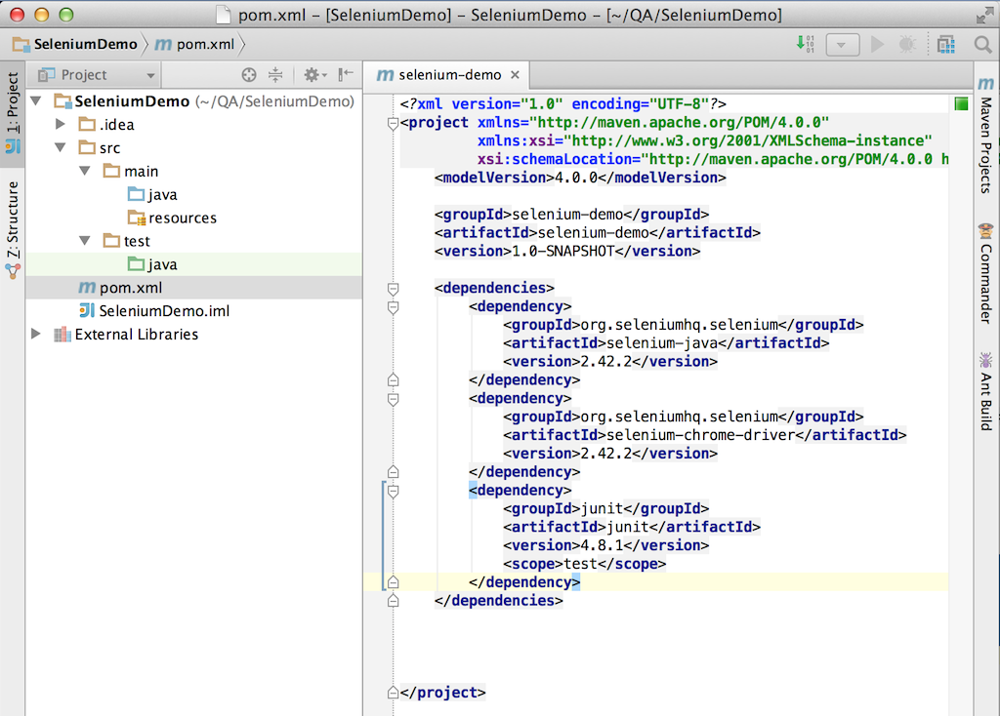

{{ page.title }}
================

07 Jul 2014 - Chengdu

## Selenium Webdriver Step by Step

### Env

- IDE - IntelliJ IDEA 
- Build - Maven 

### New Project

Project name - SeleniumDemo

### Maven Dependency

- Selenium  
- Selenium Chrome Driver
- Junit

  

